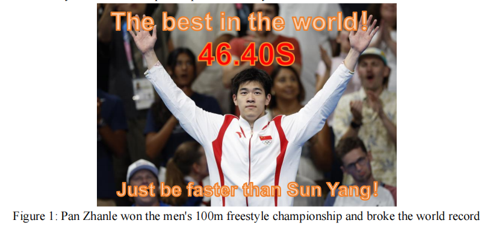

# Swimming Through Life: From Velocity Optimization to Strategic Comebacks

## Summary

At the 2024 Paris Olympics, Chinese swimmer Pan Zhanle performed exceptionally, 
breaking the world record in men's 100-meter freestyle and winning the gold medal in the men's 
4×100-meter medley relay, becoming the focus of the world. This article establishes a biomechanical velocity optimization model (BVOM) and a velocity perturbation model (VPM) 
that includes swimming strategies by analyzing forces on the human body and combining energy consumption. Aiming to assist top-level swimmers in optimizing their training and tactics.

For Task 1, we established the BVOM model. Initially, we conducted a force analysis on 
the human body and used Newton's second law to derive the relationship between the resultant 
force and velocity and time. Then, based on the energy consumption during human motion, we 
used power as a bridge to establish the relationship between the swimming propulsion force 
and velocity. Subsequently, according to the fluid drag equation, we obtained the relationship 
between the water resistance and velocity and the athlete's frontal projection area. Through 
linear regression, we derived the relationship between the frontal projection area and height. 
Next, taking velocity as the decision variable, we determined the objective function and constraints, and discretized the problem to find a numerical solution. Finally, we used Python programming to solve for the optimal velocity distribution as shown in Figure 6, and provided 
differences among different competitions (50 meters, 100 meters, 200 meters) to validate and 
evaluate the model.

For Task 2, we established the VPOM model. Initially, we constructed three different 
perturbation functions for three distinct strategies (mutual probing strategy, leading strategy, 
and following strategy). Then, by applying these different perturbation functions to the velocity, 
we simulated the swimming speed under different strategies, thereby constructing the VPM
model. Subsequently, we combined the VPM model with the BVOM model to obtain the Velocity Perturbation Optimization Model (VPOM). We then discretized the conditions and 
perturbation functions and used Python programming to solve for the optimal velocity distribution as shown in Figure 9. Finally, analyzing the results, it was concluded that no single 
strategy is superior to the others. A combination of multiple strategies should be employed 
during competitions.

For Task 3, we first visualized the speed of Pan Zhanle during the 4x100-meter medley 
relay. Based on the conclusions drawn from Task 2, we divided the race into three phases: the 
initial phase, the acceleration phase, and the decisive phase, each implementing different strategies. In the initial phase, a leading strategy was adopted. During the acceleration phase, a 
combination of following and mutual probing strategies was used. In the decisive phase, a 
combination of leading and mutual probing strategies was employed. Finally, we programmed 
to solve for the optimal swimming speed distribution of Pan Zhanle after applying these strategies, as shown in Figure 14. Ultimately, we obtained a speed of 45.8 seconds for Pan Zhanle, 
achieving a better result than the 45.92 seconds in the final race.

Finally, This paper verifies the applicability of the model in multiple scenarios through 
sensitivity analysis and generalization. Moreover, its modeling method can be extended to 
other competitive sports, helping athletes optimize their techniques and tactics, and thus has 
extensive application value.

Keywords: BVOM；Fluid Resistance；VPOM；Secondary Perturbation；Sensitivity Analysis

## Problem Background

Swimming is one of the most popular modern competitive sports. Freestyle events are 
usually divided into different types such as short distance (such as 50 meters, 100 meters) and 
middle distance (such as 200 meters). During a game, many factors will affect the final performance, including the athlete's physical fitness, game rhythm, and energy distribution strategy. 
Therefore, compared with those sports that mainly rely on explosive power, in freestyle competitions, it is particularly important to formulate scientific strategies based on the physical 
fitness and race characteristics of specific athletes.

Different types of athletes have different physical characteristics, which are not only reflected in the strength of explosive power in a short period of time, but also in the ability to 
continuously output physical energy. Athletes with strong explosive power but insufficient endurance often find it difficult to perform at their best in middle and long distance competitions.
vice versa. By mathematically modeling the changes in physical energy consumption and speed 
of athletes during swimming, coaches can develop optimal competition strategies to help athletes achieve the best results under their specific physical conditions. Scientific competition 
strategies can not only help top athletes set records, but also provide personalized training plans 
for ordinary swimmers to improve sports efficiency.

## Restatement of the Problem

In freestyle competitions, athletes' performance is affected by many factors, especially the 
optimization of physical energy distribution and speed control strategies. In order to better understand and improve athlete performance in freestyle competitions, the following questionsneed to be answered:
- Task 1: Scientifically arrange speed distribution through mathematical modeling to enable 
athletes to achieve optimal results in freestyle competitions of different distances (50 meters, 100 meters, and 200 meters).
- Task 2: Study how tactical interactions between athletes (such as leading and following 
strategies) affect individual performance and whether there is an optimal strategy for different competition situations.
- Task 3: Based on Pan Zhanle's performance in the relay race, formulate the best competition strategy to help athletes perform at their highest level and achieve better results.
